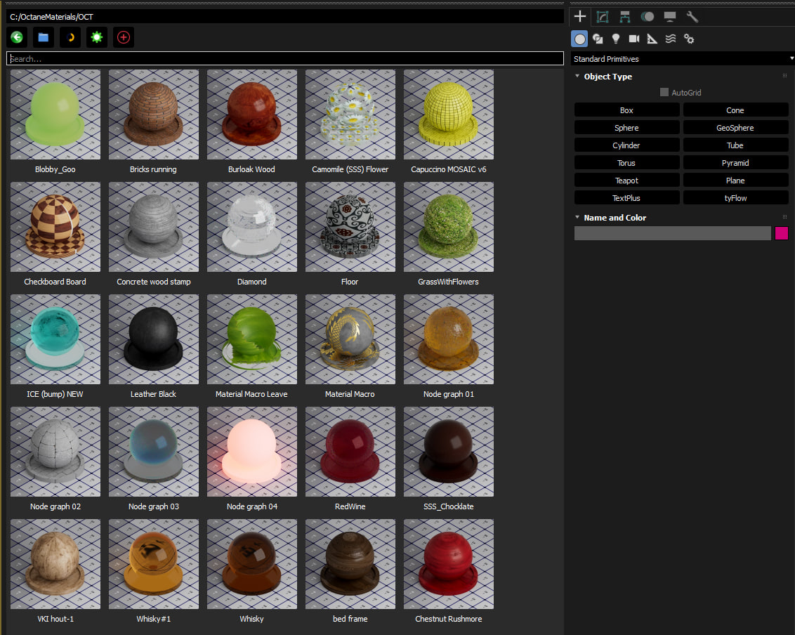
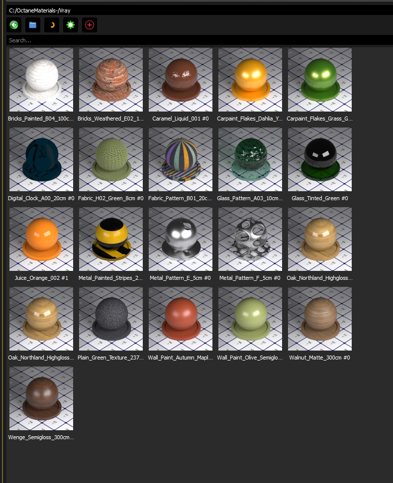

# Material Assets Browser (Open Beta) 🚀
Material Assets Browser for Autodesk 3ds Max 2025+

Developed by: Iman Shirani

[](https://www.paypal.com/donate/?hosted_button_id=LAMNRY6DDWDC4)

A powerful and flexible material library manager for **3ds Max**, supporting multiple render engines including **Octane**, **RedShift**, **Fstorm**, **V-Ray**, **Arnold**, and **Corona**.




---

## ✨ Features

- 🔍 Real-time folder browsing
- 🎨 Material preview thumbnails (auto-generated)
- 🎡Matcap Generator(auto-generated)
- 🖱️ Right-click context menu:
  - Rename / Delete
  - Assign to selected objects
  - Generate thumbnail
  - Create Octane PBR material from folders
- ⚙️ Configurable material root folder
- 💾 Persistent settings in JSON
- 🌗 Future support for light/dark UI themes
- ❤️ Donation support for future development

---

## 📦 Installation

1. Copy the project folder to your **3ds Max scripts** directory.
2. Launch `Material Assets Browser.py` from the **Scripting > Run Script...** menu.
3. Set your material root folder from **Settings**.

---

## ☕ Support Development

If you enjoy this tool and want to support future updates:

[](https://www.paypal.com/donate/?hosted_button_id=LAMNRY6DDWDC4)

Thanks for your support! 🙏✨

## 📜 License

This project is licensed under the **MIT License**.

You are free to:
📦 Use — for commercial and non-commercial purposes
🛠️ Modify — change the code as you wish
🚀 Distribute — share it with others

Just remember to include the original copyright notice.

---

```
MIT License

Copyright (c) 2025 Iman Shirani

Permission is hereby granted, free of charge, to any person obtaining a copy
of this software and associated documentation files (the "Software"), to deal
in the Software without restriction, including without limitation the rights
to use, copy, modify, merge, publish, distribute, sublicense, and/or sell
copies of the Software, and to permit persons to whom the Software is
furnished to do so, subject to the following conditions:

The above copyright notice and this permission notice shall be included in all
copies or substantial portions of the Software.

THE SOFTWARE IS PROVIDED "AS IS", WITHOUT WARRANTY OF ANY KIND, EXPRESS OR
IMPLIED, INCLUDING BUT NOT LIMITED TO THE WARRANTIES OF MERCHANTABILITY,
FITNESS FOR A PARTICULAR PURPOSE AND NONINFRINGEMENT. IN NO EVENT SHALL THE
AUTHORS OR COPYRIGHT HOLDERS BE LIABLE FOR ANY CLAIM, DAMAGES OR OTHER
LIABILITY, WHETHER IN AN ACTION OF CONTRACT, TORT OR OTHERWISE, ARISING FROM,
OUT OF OR IN CONNECTION WITH THE SOFTWARE OR THE USE OR OTHER DEALINGS IN THE
SOFTWARE.
```

