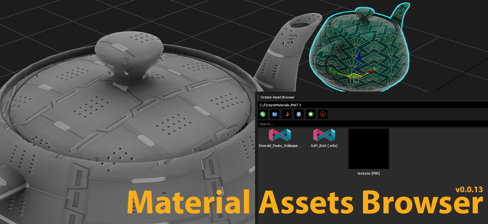

# Material Assets Browser (Open Beta) 🚀
Material Assets Browser for Autodesk 3ds Max 2025+

Developed by: Iman Shirani

[](https://www.paypal.com/donate/?hosted_button_id=LAMNRY6DDWDC4)


A powerful and flexible material library manager for 3ds Max, supporting multiple render engines and modern material standards like MaterialX. This script is designed to speed up the workflow for 3D artists.

supporting multiple render engines including **Octane**, **RedShift**, **Fstorm**, **V-Ray**, **Arnold**, and **Corona**.




---

## ✨ Features

Modern Standard Support
- MaterialX Workflow: Automatically create Material Libraries (.mat) from .mtlx files. The tool intelligently adds dependent texture paths to 3ds Max's configuration to ensure materials display correctly.
- 🎡 MatCap Generator: Convert any image file into a ready-to-use MatCap material, ideal for sculpting and model previews.

Management and Efficiency
- 👁️ Live Material Previews: View auto-generated thumbnails for all materials.
- 🎨 Material preview thumbnails (auto-generated)
- 🖱️ Powerful Context Menu:
  - Rename and delete files and folders.
  - Assign materials directly to selected objects in the scene.
  - Easily move materials between folders.
  - Regenerate thumbnails on demand.
- ⚙️ Configurable Root Folder: Easily set your main material library folder through the settings.
- 💾 Persistent Settings: All your settings are saved in a JSON file, so they persist between sessions.
- ❤️ Donation support for future development

---

## 📦 Installation

1. Copy the project folder to your **3ds Max scripts** directory.
2. Launch `Material Assets Browser.py` from the **Scripting > Run Script...** menu.
3. Set your material root folder from **Settings**.

---

## ☕ Support Development

If you enjoy this tool and want to support future updates, please consider donating:

[](https://www.paypal.com/donate/?hosted_button_id=LAMNRY6DDWDC4)

Thanks for your support! 🙏✨

## 📜 License

This project is licensed under the **MIT License**.

You are free to:
- 📦 Use — for commercial and non-commercial purposes
- 🛠️ Modify — change the code as you wish
- 🚀 Distribute — share it with others

Just remember to include the original copyright notice.

---

```
MIT License

Copyright (c) 2025 Iman Shirani

Permission is hereby granted, free of charge, to any person obtaining a copy
of this software and associated documentation files (the "Software"), to deal
in the Software without restriction, including, without limitation, the rights
to use, copy, modify, merge, publish, distribute, sublicense, and/or sell
copies of the Software, and to permit persons to whom the Software is
furnished to do so, subject to the following conditions:

The above copyright notice and this permission notice shall be included in all
copies or substantial portions of the Software.

THE SOFTWARE IS PROVIDED "AS IS", WITHOUT WARRANTY OF ANY KIND, EXPRESS OR
IMPLIED, INCLUDING BUT NOT LIMITED TO THE WARRANTIES OF MERCHANTABILITY,
FITNESS FOR A PARTICULAR PURPOSE AND NONINFRINGEMENT. IN NO EVENT SHALL THE
AUTHORS OR COPYRIGHT HOLDERS BE LIABLE FOR ANY CLAIM, DAMAGES OR OTHER
LIABILITY, WHETHER IN AN ACTION OF CONTRACT, TORT OR OTHERWISE, ARISING FROM,
OUT OF OR IN CONNECTION WITH THE SOFTWARE OR THE USE OR OTHER DEALINGS IN THE
SOFTWARE.
```

